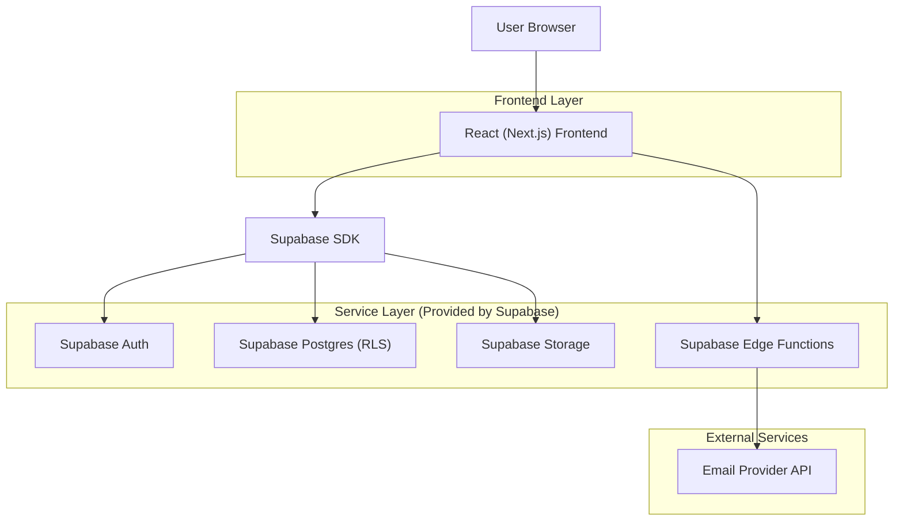
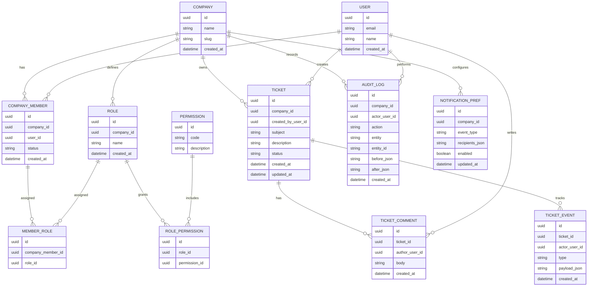

## 1.Architecture design



## 2.Technology Description
- Frontend: React@18 (Next.js App Router) + TypeScript + tailwindcss
- Backend: Supabase (Auth + Postgres + Storage + Edge Functions)

## 3.Route definitions
| Route | Purpose |
|-------|---------|
| /login | Login e seleção de empresa (quando aplicável) |
| /app | Painel do cliente (resumo + lista/criação de tickets) |
| /app/tickets/[id] | Detalhe do ticket (comentários + histórico) |
| /app/admin | Administração da empresa (membros, RBAC, auditoria, notificações) |

## 6.Data model(if applicable)

### 6.1 Data model definition


### 6.2 Data Definition Language
**Observações de segurança (essenciais)**
- Multi-tenant por `company_id` em todas as tabelas de negócio.
- RLS habilitado e políticas baseadas em `auth.uid()` + associação em `company_members` + permissões (RBAC).
- Auditoria obrigatória para ações sensíveis (RBAC, remoção de membros, mudanças de status).

**Tabelas principais (DDL simplificado)**
```sql
-- Extensões
create extension if not exists pgcrypto;

-- Empresas
create table if not exists companies (
  id uuid primary key default gen_random_uuid(),
  name text not null,
  slug text not null unique,
  created_at timestamptz not null default now()
);

-- Membros por empresa (vínculo)
create table if not exists company_members (
  id uuid primary key default gen_random_uuid(),
  company_id uuid not null,
  user_id uuid not null,
  status text not null default 'active',
  created_at timestamptz not null default now()
);
create index if not exists idx_company_members_company_id on company_members(company_id);
create index if not exists idx_company_members_user_id on company_members(user_id);

-- RBAC
create table if not exists roles (
  id uuid primary key default gen_random_uuid(),
  company_id uuid not null,
  name text not null,
  created_at timestamptz not null default now()
);
create index if not exists idx_roles_company_id on roles(company_id);

create table if not exists permissions (
  id uuid primary key default gen_random_uuid(),
  code text not null unique,
  description text not null
);

create table if not exists role_permissions (
  id uuid primary key default gen_random_uuid(),
  role_id uuid not null,
  permission_id uuid not null
);
create index if not exists idx_role_permissions_role_id on role_permissions(role_id);

create table if not exists member_roles (
  id uuid primary key default gen_random_uuid(),
  company_member_id uuid not null,
  role_id uuid not null
);
create index if not exists idx_member_roles_company_member_id on member_roles(company_member_id);

-- Tickets
create table if not exists tickets (
  id uuid primary key default gen_random_uuid(),
  company_id uuid not null,
  created_by_user_id uuid not null,
  subject text not null,
  description text not null,
  status text not null default 'open',
  created_at timestamptz not null default now(),
  updated_at timestamptz not null default now()
);
create index if not exists idx_tickets_company_id on tickets(company_id);
create index if not exists idx_tickets_updated_at on tickets(updated_at desc);

create table if not exists ticket_comments (
  id uuid primary key default gen_random_uuid(),
  ticket_id uuid not null,
  author_user_id uuid not null,
  body text not null,
  created_at timestamptz not null default now()
);
create index if not exists idx_ticket_comments_ticket_id on ticket_comments(ticket_id);

create table if not exists ticket_events (
  id uuid primary key default gen_random_uuid(),
  ticket_id uuid not null,
  actor_user_id uuid not null,
  type text not null,
  payload_json jsonb not null default '{}'::jsonb,
  created_at timestamptz not null default now()
);
create index if not exists idx_ticket_events_ticket_id on ticket_events(ticket_id);

-- Auditoria
create table if not exists audit_logs (
  id uuid primary key default gen_random_uuid(),
  company_id uuid not null,
  actor_user_id uuid not null,
  action text not null,
  entity text not null,
  entity_id text not null,
  before_json jsonb,
  after_json jsonb,
  created_at timestamptz not null default now()
);
create index if not exists idx_audit_logs_company_id on audit_logs(company_id);
create index if not exists idx_audit_logs_created_at on audit_logs(created_at desc);

-- Preferências de notificação
create table if not exists notification_prefs (
  id uuid primary key default gen_random_uuid(),
  company_id uuid not null,
  event_type text not null,
  recipients_json jsonb not null default '[]'::jsonb,
  enabled boolean not null default true,
  updated_at timestamptz not null default now()
);
create index if not exists idx_notification_prefs_company_id on notification_prefs(company_id);

-- Grants (padrão Supabase)
grant select on companies, tickets, ticket_comments, ticket_events, audit_logs, roles, permissions, role_permissions, member_roles, company_members, notification_prefs to anon;
grant all privileges on companies, tickets, ticket_comments, ticket_events, audit_logs, roles, permissions, role_permissions, member_roles, company_members, notification_prefs to authenticated;
```

**Envio de emails (Edge Function)**
- Implementar uma Edge Function (ex.: `send_ticket_notification`) que:
  - recebe `event_type`, `company_id`, `ticket_id`;
  - resolve destinatários via `notification_prefs` e membros elegíveis;
  - chama um provedor de email (ex.: SendGrid/Resend) com segredo armazenado em variáveis do Supabase.
