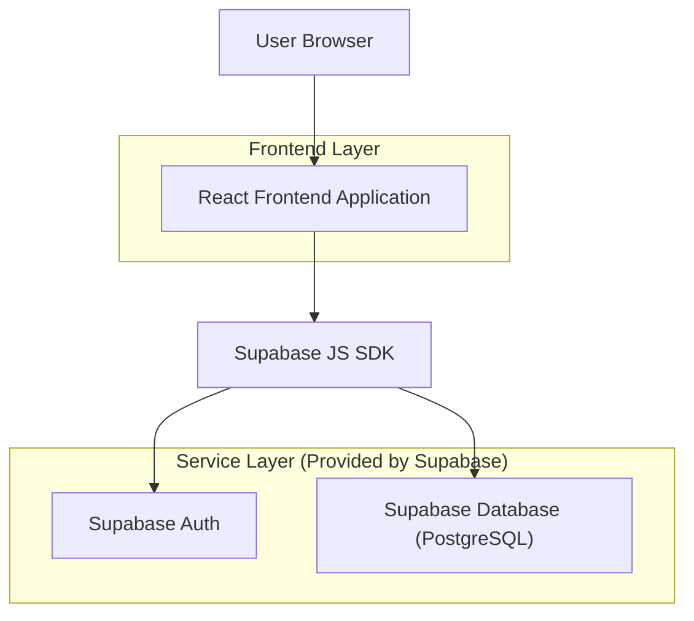
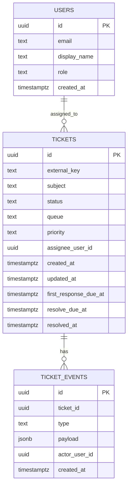

## 1.Architecture design


## 2.Technology Description
- Frontend: React@18 + TypeScript + vite + tailwindcss@3
- Data/State: @tanstack/react-query + zustand (ou Context) para estado de UI (filtros)
- Charts: recharts (ou echarts)
- Table: @tanstack/react-table + virtualização (ex.: react-virtual)
- Backend: Supabase (Auth + PostgreSQL) via supabase-js

## 3.Route definitions
| Route | Purpose |
|-------|---------|
| /login | Autenticação do usuário |
| / | Dashboard operacional com métricas, gráficos, filtros, exportação e auto-refresh |
| /tickets/:id | Detalhe do ticket e histórico |

## 6.Data model(if applicable)

### 6.1 Data model definition


### 6.2 Data Definition Language
Ticket Table (tickets)
```sql
-- create table
CREATE TABLE tickets (
  id UUID PRIMARY KEY DEFAULT gen_random_uuid(),
  external_key TEXT,
  subject TEXT NOT NULL,
  status TEXT NOT NULL,
  queue TEXT NOT NULL,
  priority TEXT NOT NULL,
  assignee_user_id UUID,
  created_at TIMESTAMPTZ NOT NULL DEFAULT NOW(),
  updated_at TIMESTAMPTZ NOT NULL DEFAULT NOW(),
  first_response_due_at TIMESTAMPTZ,
  resolve_due_at TIMESTAMPTZ,
  resolved_at TIMESTAMPTZ
);

CREATE INDEX idx_tickets_queue_status ON tickets(queue, status);
CREATE INDEX idx_tickets_updated_at ON tickets(updated_at DESC);

-- grants (guideline baseline)
GRANT SELECT ON tickets TO anon;
GRANT ALL PRIVILEGES ON tickets TO authenticated;
```

Ticket Events Table (ticket_events)
```sql
CREATE TABLE ticket_events (
  id UUID PRIMARY KEY DEFAULT gen_random_uuid(),
  ticket_id UUID NOT NULL,
  type TEXT NOT NULL,
  payload JSONB NOT NULL DEFAULT '{}'::jsonb,
  actor_user_id UUID,
  created_at TIMESTAMPTZ NOT NULL DEFAULT NOW()
);

CREATE INDEX idx_ticket_events_ticket_id_created_at ON ticket_events(ticket_id, created_at DESC);

GRANT SELECT ON ticket_events TO anon;
GRANT ALL PRIVILEGES ON ticket_events TO authenticated;
```

Notas de performance (essenciais)
- Consultas do Dashboard devem usar filtros indexáveis (período, queue, status, priority) e paginação.
- KPIs podem ser calculados via views SQL (ex.: contagens por status/fila) para reduzir lógica no cliente.
- Auto-refresh via polling controlado (ex.: 15–60s) e invalidation no React Query para evitar re-render excessivo.
