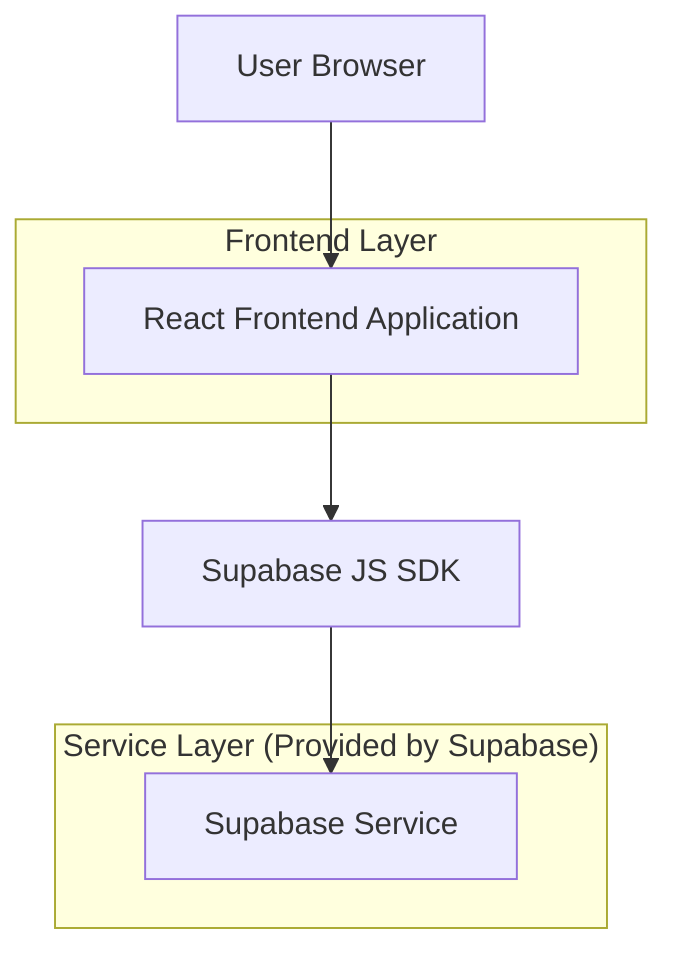
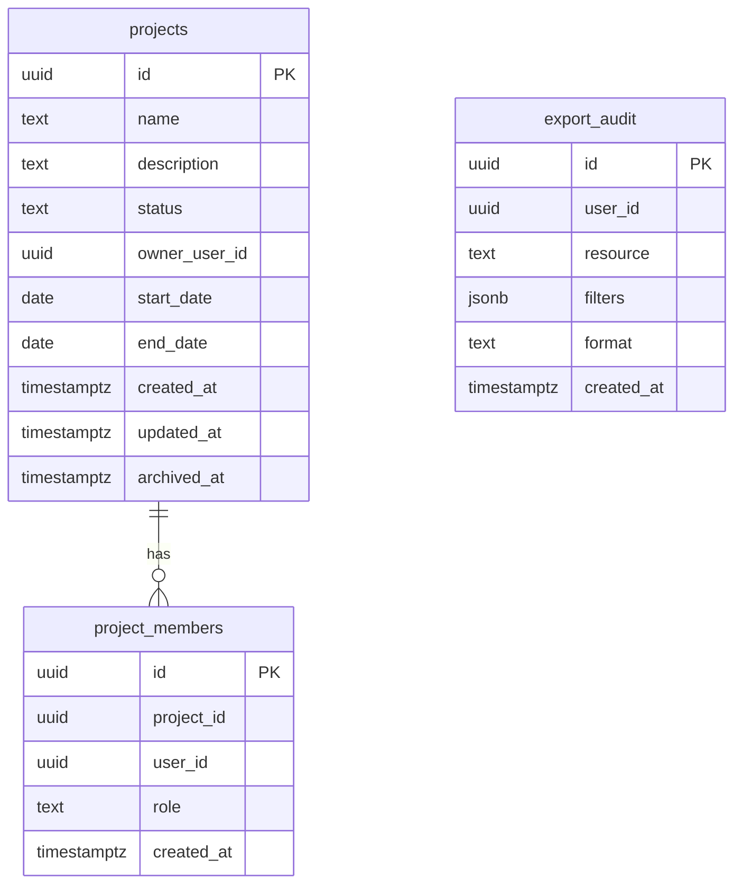

## 1.Architecture design


## 2.Technology Description
- Frontend: React@18 + TypeScript + vite + tailwindcss@3
- Backend: Supabase (Auth + Postgres + Storage + (opcional) Edge Functions)
- Tests: Vitest + React Testing Library + Playwright

## 3.Route definitions
| Route | Purpose |
|-------|---------|
| /projetos/dashboard | Dashboard do módulo (KPIs, atalhos e resumos) |
| /projetos | Lista de projetos com busca/filtros e paginação |
| /projetos/novo | Criação de projeto (pode ser modal/rota) |
| /projetos/:id | Detalhe do projeto |
| /projetos/:id/editar | Edição do projeto |
| /projetos/relatorios | Relatórios e exportação |

## 4.API definitions
### 4.1 Tipos compartilhados (TypeScript)
```ts
export type ProjectStatus = 'draft' | 'active' | 'archived';

export type Project = {
  id: string;
  name: string;
  description: string | null;
  status: ProjectStatus;
  owner_user_id: string;
  start_date: string | null; // ISO date
  end_date: string | null;   // ISO date
  created_at: string;        // ISO datetime
  updated_at: string;        // ISO datetime
  archived_at: string | null;
};

export type ProjectListQuery = {
  q?: string;
  status?: ProjectStatus;
  owner_user_id?: string;
  start_date_from?: string;
  end_date_to?: string;
  page?: number;
  page_size?: number;
  order_by?: 'created_at' | 'updated_at' | 'name';
  order_dir?: 'asc' | 'desc';
};
```

### 4.2 API (Supabase REST + consultas)
- CRUD (via PostgREST)
  - GET /rest/v1/projects
  - POST /rest/v1/projects
  - PATCH /rest/v1/projects?id=eq.:id
  - DELETE /rest/v1/projects?id=eq.:id
- Busca/filtros
  - Preferir `.ilike('name', '%q%')` e filtros por colunas (status/datas/owner_user_id).
  - (Opcional) Para busca avançada, criar coluna `search_text` ou uma VIEW para indexação.
- Relatórios/exportação
  - MVP: gerar CSV/XLSX no frontend a partir da consulta filtrada.
  - (Opcional) Para volumes grandes: Edge Function `POST /functions/v1/projects-export` (gera arquivo e salva no Storage com URL assinada).

## 6.Data model(if applicable)

### 6.1 Data model definition


### 6.2 Data Definition Language
Project Table (projects)
```sql
CREATE TABLE projects (
  id UUID PRIMARY KEY DEFAULT gen_random_uuid(),
  name TEXT NOT NULL,
  description TEXT,
  status TEXT NOT NULL DEFAULT 'active',
  owner_user_id UUID NOT NULL,
  start_date DATE,
  end_date DATE,
  created_at TIMESTAMPTZ NOT NULL DEFAULT NOW(),
  updated_at TIMESTAMPTZ NOT NULL DEFAULT NOW(),
  archived_at TIMESTAMPTZ
);

CREATE INDEX idx_projects_status ON projects(status);
CREATE INDEX idx_projects_owner ON projects(owner_user_id);
CREATE INDEX idx_projects_created_at ON projects(created_at DESC);
CREATE INDEX idx_projects_name ON projects(name);

GRANT SELECT ON projects TO anon;
GRANT ALL PRIVILEGES ON projects TO authenticated;
```

Membership Table (project_members)
```sql
CREATE TABLE project_members (
  id UUID PRIMARY KEY DEFAULT gen_random_uuid(),
  project_id UUID NOT NULL,
  user_id UUID NOT NULL,
  role TEXT NOT NULL DEFAULT 'member',
  created_at TIMESTAMPTZ NOT NULL DEFAULT NOW()
);

CREATE INDEX idx_project_members_project_id ON project_members(project_id);
CREATE INDEX idx_project_members_user_id ON project_members(user_id);

GRANT SELECT ON project_members TO anon;
GRANT ALL PRIVILEGES ON project_members TO authenticated;
```

Export Audit (export_audit)
```sql
CREATE TABLE export_audit (
  id UUID PRIMARY KEY DEFAULT gen_random_uuid(),
  user_id UUID NOT NULL,
  resource TEXT NOT NULL,
  filters JSONB NOT NULL DEFAULT '{}'::jsonb,
  format TEXT NOT NULL,
  created_at TIMESTAMPTZ NOT NULL DEFAULT NOW()
);

CREATE INDEX idx_export_audit_user_id ON export_audit(user_id);
CREATE INDEX idx_export_audit_created_at ON export_audit(created_at DESC);

GRANT SELECT ON export_audit TO anon;
GRANT ALL PRIVILEGES ON export_audit TO authenticated;
```

RLS (visão geral)
```sql
-- Habilitar RLS
ALTER TABLE projects ENABLE ROW LEVEL SECURITY;
ALTER TABLE project_members ENABLE ROW LEVEL SECURITY;
ALTER TABLE export_audit ENABLE ROW LEVEL SECURITY;

-- Exemplo (conceitual): permitir SELECT em projects se você é owner ou membro
-- (implementar usando auth.uid() e relação lógica via project_members)
```

Acessibilidade e qualidade (diretrizes de implementação)
- A11y: componentes com foco visível, navegação por teclado, roles/aria, headings consistentes e tabelas com headers.
- Testes: unit (validação, utilitários), integração (hooks/queries com mocks), E2E (CRUD + busca/filtros + export).