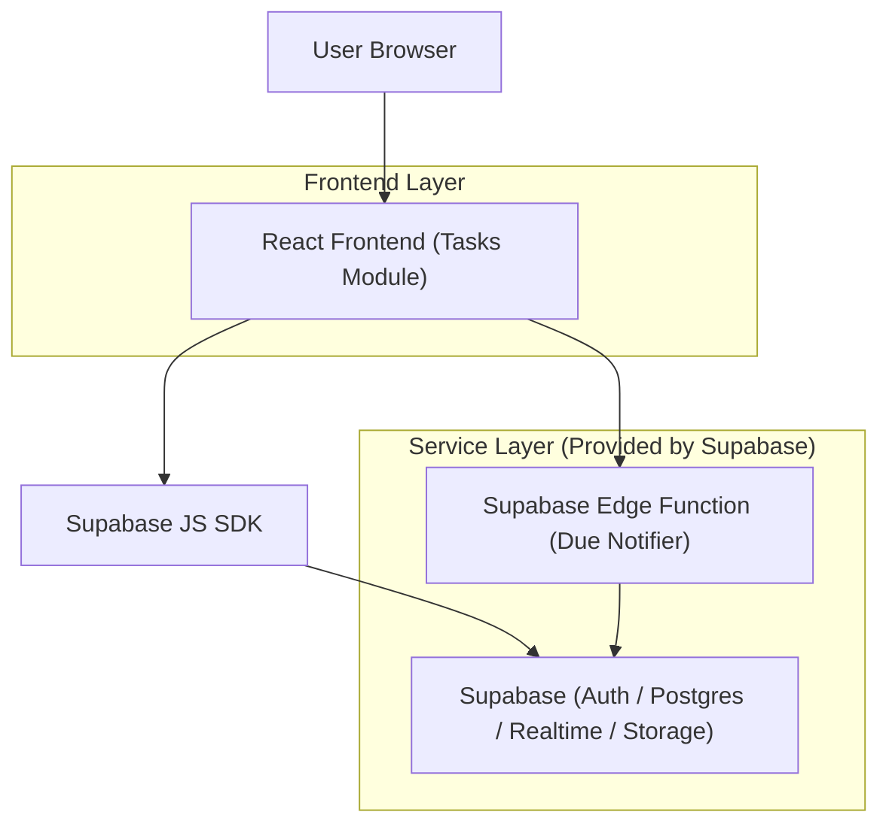
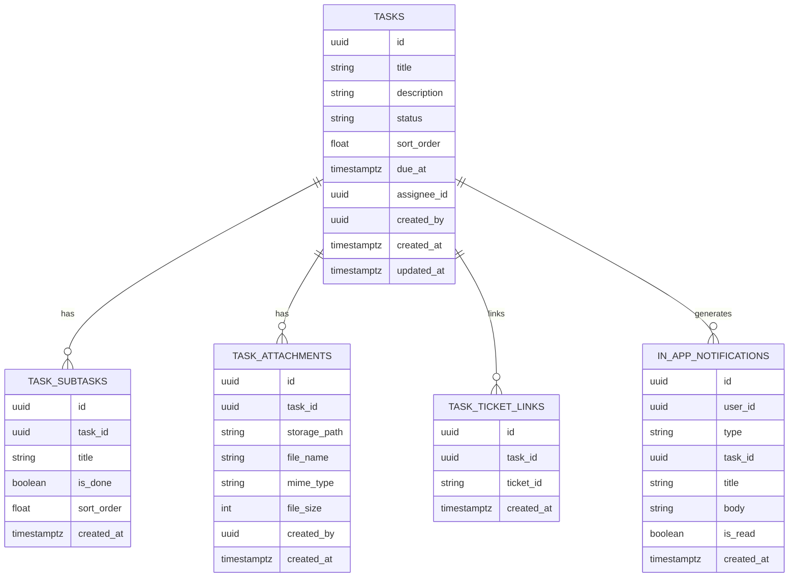

## 1.Architecture design


## 2.Technology Description
- Frontend: React@18 + TypeScript + vite + tailwindcss@3 + dnd-kit (drag-and-drop) + react-router
- Backend: Supabase (Auth + Postgres + Realtime + Storage + Edge Functions)

## 3.Route definitions
| Route | Purpose |
|-------|---------|
| /tasks | Página principal do módulo: Kanban/Lista, filtros, CRUD rápido e painel de notificações |
| /tasks/:taskId | Detalhe completo da tarefa (subtarefas, anexos, tickets vinculados) |
| /tasks/settings/notifications | Preferências de notificação de vencimento |

## 4.API definitions (If it includes backend services)
### 4.1 Edge Function (notificações de vencimento)
Executada via agendamento (cron) para gerar notificações in-app.

```
POST /functions/v1/tasks-due-notifier
```

Request (opcional)
| Param Name | Param Type | isRequired | Description |
|-----------|------------|------------|-------------|
| dryRun | boolean | false | Apenas simula o envio (debug) |

Response
| Param Name | Param Type | Description |
|-----------|------------|-------------|
| processed | number | Quantidade de tarefas avaliadas |
| createdNotifications | number | Quantidade de notificações criadas |

### 4.2 TypeScript types (frontend)
```ts
export type TaskStatus = 'backlog' | 'todo' | 'doing' | 'done' | 'blocked'

export type Task = {
  id: string
  title: string
  description: string | null
  status: TaskStatus
  sort_order: number
  due_at: string | null
  assignee_id: string | null
  created_by: string
  created_at: string
  updated_at: string
}

export type Subtask = {
  id: string
  task_id: string
  title: string
  is_done: boolean
  sort_order: number
  created_at: string
}

export type TaskAttachment = {
  id: string
  task_id: string
  storage_path: string
  file_name: string
  mime_type: string | null
  file_size: number | null
  created_by: string
  created_at: string
}

export type TaskTicketLink = {
  id: string
  task_id: string
  ticket_id: string
  created_at: string
}

export type InAppNotification = {
  id: string
  user_id: string
  type: 'task_due_soon' | 'task_overdue'
  task_id: string
  title: string
  body: string | null
  is_read: boolean
  created_at: string
}
```

## 6.Data model(if applicable)

### 6.1 Data model definition


### 6.2 Data Definition Language
Bucket de anexos: `task-attachments` (privado).

```sql
-- tasks
create table if not exists tasks (
  id uuid primary key default gen_random_uuid(),
  title text not null,
  description text,
  status text not null default 'todo' check (status in ('backlog','todo','doing','done','blocked')),
  sort_order double precision not null default 0,
  due_at timestamptz,
  assignee_id uuid,
  created_by uuid not null,
  created_at timestamptz not null default now(),
  updated_at timestamptz not null default now()
);
create index if not exists idx_tasks_status_sort on tasks(status, sort_order);
create index if not exists idx_tasks_due_at on tasks(due_at);
create index if not exists idx_tasks_assignee on tasks(assignee_id);

-- subtasks
create table if not exists task_subtasks (
  id uuid primary key default gen_random_uuid(),
  task_id uuid not null,
  title text not null,
  is_done boolean not null default false,
  sort_order double precision not null default 0,
  created_at timestamptz not null default now()
);
create index if not exists idx_subtasks_task on task_subtasks(task_id, sort_order);

-- attachments metadata
create table if not exists task_attachments (
  id uuid primary key default gen_random_uuid(),
  task_id uuid not null,
  storage_path text not null,
  file_name text not null,
  mime_type text,
  file_size int,
  created_by uuid not null,
  created_at timestamptz not null default now()
);
create index if not exists idx_attachments_task on task_attachments(task_id);

-- ticket links (logical FK)
create table if not exists task_ticket_links (
  id uuid primary key default gen_random_uuid(),
  task_id uuid not null,
  ticket_id text not null,
  created_at timestamptz not null default now()
);
create index if not exists idx_task_ticket_links_task on task_ticket_links(task_id);
create index if not exists idx_task_ticket_links_ticket on task_ticket_links(ticket_id);

-- notification preferences
create table if not exists notification_preferences (
  user_id uuid primary key,
  due_soon_hours int not null default 24,
  overdue_daily boolean not null default true,
  in_app_enabled boolean not null default true,
  quiet_hours_start int,
  quiet_hours_end int,
  updated_at timestamptz not null default now()
);

-- in-app notifications
create table if not exists in_app_notifications (
  id uuid primary key default gen_random_uuid(),
  user_id uuid not null,
  type text not null check (type in ('task_due_soon','task_overdue')),
  task_id uuid not null,
  title text not null,
  body text,
  is_read boolean not null default false,
  created_at timestamptz not null default now()
);
create index if not exists idx_in_app_notifications_user on in_app_notifications(user_id, is_read, created_at desc);

-- RLS (sugestão base: acesso ao que você criou ou está atribuído)
alter table tasks enable row level security;
create policy "tasks_select_own_or_assigned" on tasks
for select to authenticated
using (created_by = auth.uid() or assignee_id = auth.uid());
create policy "tasks_write_own_or_assigned" on tasks
for all to authenticated
using (created_by = auth.uid() or assignee_id = auth.uid())
with check (created_by = auth.uid() or assignee_id = auth.uid());

alter table task_subtasks enable row level security;
create policy "subtasks_via_parent_task" on task_subtasks
for all to authenticated
using (exists (select 1 from tasks t where t.id = task_subtasks.task_id and (t.created_by = auth.uid() or t.assignee_id = auth.uid())))
with check (exists (select 1 from tasks t where t.id = task_subtasks.task_id and (t.created_by = auth.uid() or t.assignee_id = auth.uid())));

alter table task_attachments enable row level security;
create policy "attachments_via_parent_task" on task_attachments
for all to authenticated
using (exists (select 1 from tasks t where t.id = task_attachments.task_id and (t.created_by = auth.uid() or t.assignee_id = auth.uid())))
with check (exists (select 1 from tasks t where t.id = task_attachments.task_id and (t.created_by = auth.uid() or t.assignee_id = auth.uid())));

alter table task_ticket_links enable row level security;
create policy "ticket_links_via_parent_task" on task_ticket_links
for all to authenticated
using (exists (select 1 from tasks t where t.id = task_ticket_links.task_id and (t.created_by = auth.uid() or t.assignee_id = auth.uid())))
with check (exists (select 1 from tasks t where t.id = task_ticket_links.task_id and (t.created_by = auth.uid() or t.assignee_id = auth.uid())));

alter table notification_preferences enable row level security;
create policy "notification_prefs_own" on notification_preferences
for all to authenticated
using (user_id = auth.uid())
with check (user_id = auth.uid());

alter table in_app_notifications enable row level security;
create policy "in_app_notifications_own" on in_app_notifications
for all to authenticated
using (user_id = auth.uid())
with check (user_id = auth.uid());
```
