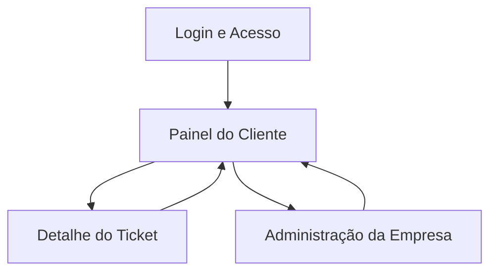

## 1. Product Overview
Área do cliente para autenticação, abertura e acompanhamento de tickets com comentários.
Inclui RBAC por empresa (multi-tenant), auditoria de ações e notificações por email.

## 2. Core Features

### 2.1 User Roles
| Papel | Método de cadastro | Permissões principais |
|------|---------------------|----------------------|
| Colaborador (Cliente) | Convite (link/email) ou cadastro com domínio permitido pela empresa | Criar tickets, comentar em tickets da própria empresa, acompanhar status e histórico |
| Gestor da Empresa (Admin) | Promovido por outro Gestor / bootstrap inicial | Gerenciar membros, atribuir papéis (RBAC), configurar notificações por email, visualizar auditoria da empresa |
| Atendente (Suporte) | Criado por operação interna | Visualizar e responder tickets de empresas às quais tem acesso, registrar atualizações e comentários |

### 2.2 Feature Module
Nossa área do cliente consiste nas seguintes páginas principais:
1. **Login e Acesso**: autenticação, seleção de empresa (quando aplicável).
2. **Painel do Cliente**: visão geral e lista de tickets, criação de ticket, filtros básicos.
3. **Detalhe do Ticket**: dados do ticket, comentários, histórico/auditoria do ticket.
4. **Administração da Empresa**: membros e papéis (RBAC), auditoria, preferências de notificações por email.

### 2.3 Page Details
| Page Name | Module Name | Feature description |
|-----------|-------------|---------------------|
| Login e Acesso | Autenticação | Entrar com email/senha; manter sessão; sair; bloquear acesso sem autenticação |
| Login e Acesso | Seleção de empresa | Selecionar contexto de empresa quando o usuário for membro de múltiplas empresas |
| Painel do Cliente | Resumo | Exibir contadores (ex.: abertos/pendentes/fechados) e últimos tickets atualizados |
| Painel do Cliente | Lista de tickets | Listar tickets da empresa conforme RBAC; filtrar por status e busca por texto; paginar |
| Painel do Cliente | Criar ticket | Criar ticket com assunto e descrição; anexar opcionalmente; definir como “aberto” |
| Detalhe do Ticket | Cabeçalho do ticket | Exibir assunto, status, criador, datas, responsáveis (quando aplicável) |
| Detalhe do Ticket | Comentários | Adicionar comentário; listar comentários em ordem cronológica; identificar autor e horário |
| Detalhe do Ticket | Histórico do ticket | Mostrar linha do tempo de eventos (criação, mudança de status, novos comentários) |
| Administração da Empresa | Membros | Convidar membro por email; listar membros; desativar/remover acesso |
| Administração da Empresa | RBAC | Criar/editar papéis; atribuir papéis a membros; validar permissões por empresa |
| Administração da Empresa | Auditoria | Listar logs de auditoria da empresa; filtrar por usuário/ação/data; detalhar mudanças |
| Administração da Empresa | Notificações por email | Configurar preferências por evento (ticket criado/atualizado/novo comentário) e destinatários |

## 3. Core Process
**Fluxo Colaborador (Cliente)**
1. Você faz login e escolhe a empresa (se necessário).
2. Você acessa o Painel, cria um ticket com assunto e descrição.
3. Você acompanha o ticket na lista, abre o Detalhe e adiciona comentários.
4. Você recebe emails (conforme preferências) quando houver atualização/comentário.

**Fluxo Gestor da Empresa (Admin)**
1. Você faz login e acessa Administração.
2. Você convida membros, atribui papéis e ajusta permissões (RBAC) da empresa.
3. Você consulta Auditoria para rastrear alterações e ações de usuários.
4. Você configura Notificações por email para a empresa.

**Fluxo Atendente (Suporte)**
1. Você faz login e acessa tickets das empresas permitidas.
2. Você responde via comentários e registra atualizações do ticket.
3. Suas ações ficam registradas na auditoria e geram emails conforme as regras.

