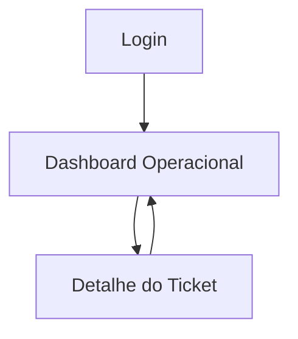

## 1. Product Overview
Dashboard operacional de tickets para acompanhar volume, SLA e produtividade em tempo real.
Focado em operadores e liderança para decisão rápida com filtros, exportação e auto-refresh.

## 2. Core Features

### 2.1 User Roles
| Papel | Método de cadastro | Permissões principais |
|------|---------------------|----------------------|
| Operador | Convite/conta corporativa (email) | Visualizar dashboard, filtrar, exportar, abrir detalhes do ticket |
| Supervisor | Convite/conta corporativa (email) | Tudo do Operador + salvar visões/filtros compartilháveis |

### 2.2 Feature Module
Nosso dashboard operacional consiste nas seguintes páginas principais:
1. **Login**: autenticação, recuperação de sessão.
2. **Dashboard Operacional**: KPIs, gráficos, tabela de tickets, filtros, auto-refresh, exportação.
3. **Detalhe do Ticket**: visão completa do ticket e histórico para investigação.

### 2.3 Page Details
| Page Name | Module Name | Feature description |
|-----------|-------------|---------------------|
| Login | Autenticação | Autenticar via email/senha (ou SSO corporativo, se habilitado) e redirecionar para o Dashboard. |
| Login | Persistência de sessão | Manter sessão ativa e permitir logout seguro. |
| Dashboard Operacional | KPIs principais | Exibir métricas (ex.: abertos, novos hoje, resolvidos hoje, backlog por fila, SLA em risco/estourado) com atualização periódica. |
| Dashboard Operacional | Gráficos | Visualizar tendências e distribuição (ex.: entradas vs saídas por tempo, por status, por fila, por prioridade) com tooltips e legenda. |
| Dashboard Operacional | Filtros e segmentação | Filtrar por período, status, fila, prioridade, responsável, tags e canal; aplicar/limpar rapidamente; refletir filtros em KPIs, gráficos e tabela. |
| Dashboard Operacional | Tabela de tickets (visão operacional) | Listar tickets filtrados com paginação, ordenação e busca; destacar SLA/idade; abrir Detalhe do Ticket. |
| Dashboard Operacional | Auto-refresh | Atualizar dados automaticamente (intervalo configurável) com indicação de “última atualização” e botão “atualizar agora”. |
| Dashboard Operacional | Exportação | Exportar a visão filtrada (CSV/XLSX) incluindo colunas selecionadas e período aplicado. |
| Dashboard Operacional | Performance percebida | Carregar rapidamente via cache local/estado, carregamentos incrementais e placeholders (skeleton) em KPIs/gráficos/tabela. |
| Detalhe do Ticket | Resumo e atributos | Exibir dados essenciais (assunto, status, fila, prioridade, responsável, SLA, timestamps, tags) e permitir voltar ao Dashboard mantendo filtros. |
| Detalhe do Ticket | Linha do tempo (histórico) | Mostrar eventos do ticket (mudanças de status, atribuições, comentários/ações) em ordem temporal para auditoria operacional. |

## 3. Core Process
**Operador**: faz login → acessa o Dashboard → aplica filtros para sua fila/período → acompanha KPIs e gráficos → identifica tickets críticos (SLA em risco) → abre Detalhe do Ticket para investigar → volta ao Dashboard mantendo o contexto → exporta a visão quando necessário.

**Supervisor**: faz login → ajusta filtros para visão gerencial (por filas/prioridades) → acompanha tendências e backlog → salva/compartilha uma visão padrão (quando disponível) → exporta recortes para reporte.

