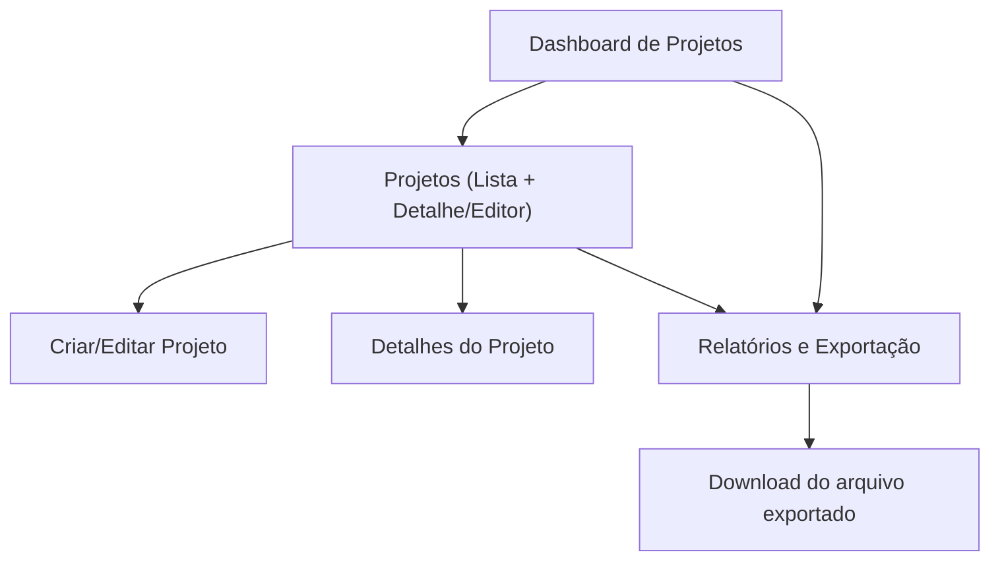

## 1. Product Overview
Módulo de Projetos para criar, organizar e acompanhar projetos em um dashboard, com busca/filtros e relatórios/exportação.
Focado em produtividade operacional, rastreabilidade e acesso rápido a informações do portfólio.

## 2. Core Features

### 2.1 User Roles
| Papel | Método de cadastro | Permissões principais |
|------|---------------------|-----------------------|
| Usuário autenticado | Login existente do produto (ex.: e-mail/SSO) | CRUD de projetos conforme permissão; visualizar dashboard; usar filtros/busca; exportar relatórios permitidos. |
| Administrador | Atribuição interna | Acesso total aos projetos; gerenciar visibilidade; acessar relatórios completos; auditoria básica. |

### 2.2 Feature Module
O módulo de Projetos consiste nas seguintes páginas principais:
1. **Dashboard de Projetos**: KPIs, cards/resumos, listas rápidas (recentes, em risco), atalhos.
2. **Projetos (Lista + Detalhe/Editor)**: CRUD, busca/filtros, visualização de detalhes, histórico básico.
3. **Relatórios e Exportação**: relatórios por período/status, pré-visualização e exportação (CSV/XLSX/PDF, conforme definido).

### 2.3 Page Details
| Page Name | Module Name | Feature description |
|-----------|-------------|---------------------|
| Dashboard de Projetos | KPIs e Resumos | Exibir contagens e métricas (ex.: total, por status, vencendo) e permitir clique para aplicar filtro na lista. |
| Dashboard de Projetos | Listas rápidas | Mostrar “recentes”, “favoritos/seguindo (se aplicável)”, “em risco/atrasados (se aplicável)” com navegação ao detalhe. |
| Projetos (Lista + Detalhe/Editor) | Busca e Filtros | Buscar por texto; filtrar por status, responsável, datas e tags (se aplicável); salvar/limpar filtros. |
| Projetos (Lista + Detalhe/Editor) | Listagem | Listar projetos com paginação/ordenação; exibir colunas principais; permitir abrir detalhe. |
| Projetos (Lista + Detalhe/Editor) | Criar/Editar | Criar e editar projeto com validação; estados (rascunho/ativo/arquivado, se aplicável); cancelar/salvar. |
| Projetos (Lista + Detalhe/Editor) | Detalhes | Exibir campos completos; ações principais (editar, arquivar/reativar, excluir com confirmação). |
| Projetos (Lista + Detalhe/Editor) | Permissões | Restringir visualização/edição conforme papel e vínculo do usuário ao projeto. |
| Relatórios e Exportação | Configuração do relatório | Selecionar período, filtros e formato; reutilizar filtros do módulo. |
| Relatórios e Exportação | Pré-visualização | Mostrar amostra/total estimado e avisos de volume antes de exportar. |
| Relatórios e Exportação | Exportação | Gerar e baixar arquivo; registrar evento de exportação (quem/quando/filtros). |
| Todas as páginas | Acessibilidade | Garantir navegação por teclado, foco visível, contraste, labels/aria; suportar leitores de tela em tabelas/formulários. |
| Todas as páginas | Testes | Cobrir fluxos críticos (CRUD, busca/filtros, exportação) com testes unitários, integração e E2E. |
| Todas as páginas | Integração via API | Consumir API para listar/criar/editar/excluir projetos e gerar relatórios conforme permissões. |

## 3. Core Process
**Fluxo do Usuário autenticado**: você acessa o Dashboard para ver KPIs e atalhos; entra em Projetos para buscar/filtrar; cria ou edita um projeto; abre detalhes para revisar; quando necessário, vai em Relatórios e Exportação, configura filtros/período e baixa o arquivo.

**Fluxo do Administrador**: além do fluxo padrão, você acessa todos os projetos, aplica filtros globais, realiza ações administrativas (ex.: arquivar/excluir com confirmação reforçada) e exporta relatórios completos.

