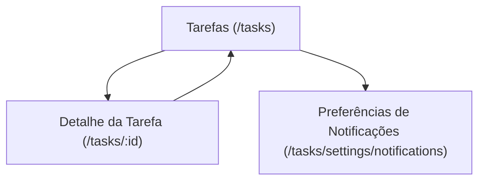

## 1. Product Overview

Módulo **/tasks** para criar, organizar e acompanhar tarefas vinculadas a tickets.
Inclui visão Kanban com drag-and-drop, subtarefas, anexos, filtros e alertas de vencimento.

## 2. Core Features

### 2.1 User Roles

| Papel               | Método de cadastro         | Permissões principais                                                                                                                                   |
| ------------------- | -------------------------- | ------------------------------------------------------------------------------------------------------------------------------------------------------- |
| Usuário autenticado | Login do produto existente | Criar/editar tarefas próprias; ver tarefas atribuídas; anexar arquivos; gerenciar subtarefas; vincular a tickets; configurar notificações de vencimento |

### 2.2 Feature Module

Nosso módulo de tarefas consiste nas seguintes páginas principais:

1. **Tarefas (/tasks)**: alternância Kanban/Lista, filtros, CRUD rápido (criar/editar em drawer/modal), ações em lote, notificações de vencimento.
2. **Detalhe da Tarefa (/tasks/:id)**: edição completa, subtarefas, anexos, vínculo com tickets, histórico básico de alterações.
3. **Preferências de Notificações (/tasks/settings/notifications)**: regras de alerta por vencimento e canais (in-app).

### 2.3 Page Details

| Page Name                      | Module Name                  | Feature description                                                                                                                      |
| ------------------------------ | ---------------------------- | ---------------------------------------------------------------------------------------------------------------------------------------- |
| Tarefas (/tasks)               | Alternância de visualização  | Alternar entre **Kanban** e **Lista** mantendo filtros e seleção.                                                                        |
| Tarefas (/tasks)               | Kanban drag-and-drop         | Arrastar cartões entre colunas para mudar status; reordenar dentro da coluna; persistir ordem.                                           |
| Tarefas (/tasks)               | Lista de tarefas             | Exibir tarefas em tabela com colunas essenciais (título, status, responsável, vencimento, ticket); ordenar e paginação/scroll.           |
| Tarefas (/tasks)               | Filtros                      | Filtrar por status, responsável, vinculado a ticket, texto (título/descrição), vencimento (intervalo) e “somente vencidas”.              |
| Tarefas (/tasks)               | CRUD rápido                  | Criar tarefa; editar campos principais; duplicar; concluir/reabrir; excluir com confirmação.                                             |
| Tarefas (/tasks)               | Vínculo com tickets (rápido) | Vincular/desvincular ticket a partir do cartão/linha (picker por ID/título).                                                             |
| Tarefas (/tasks)               | Ações em lote                | Selecionar múltiplas tarefas (na Lista) e aplicar status/responsável/vencimento ou excluir.                                              |
| Tarefas (/tasks)               | Notificações de vencimento   | Mostrar badge/contador de tarefas vencendo e vencidas; abrir painel com itens e atalhos para a tarefa.                                   |
| Detalhe da Tarefa (/tasks/:id) | Formulário completo          | Visualizar e editar: título, descrição, status, responsável, prioridade (se aplicável), vencimento, ordem/coluna, e vínculo com tickets. |
| Detalhe da Tarefa (/tasks/:id) | Subtarefas                   | Criar/editar/remover subtarefas; marcar concluída; reordenar; exibir progresso (%).                                                      |
| Detalhe da Tarefa (/tasks/:id) | Anexos                       | Upload/download/exclusão de arquivos; listar anexos com nome, tamanho, autor e data.                                                     |
| Detalhe da Tarefa (/tasks/:id) | Vínculo com tickets          | Vincular um ou mais tickets; navegar para o ticket (quando disponível no produto).                                                       |
| Detalhe da Tarefa (/tasks/:id) | Histórico básico             | Exibir eventos essenciais (criação, mudança de status, vencimento alterado, anexos adicionados).                                         |
| Preferências de Notificações   | Regras de alerta             | Definir antecedência (ex.: 24h/4h) e lembretes para vencidas (ex.: diário); ativar/desativar.                                            |
| Preferências de Notificações   | Canal in-app                 | Habilitar notificações no app; ajustar “silenciar” por horário (opcional simples).                                                       |

## 3. Core Process

**Fluxo do Usuário (Usuário autenticado)**

1. Você acessa **/tasks** e escolhe Kanban ou Lista.
2. Você aplica filtros (status, responsável, vencimento, ticket) para reduzir o escopo.
3. Você cria uma tarefa e preenche os campos essenciais (título, status, vencimento, responsável).
4. Você organiza no Kanban arrastando cartões (mudança de status e reordenação).
5. Você abre o **Detalhe da Tarefa** para adicionar subtarefas, anexos e vincular tickets.
6. Próximo ao vencimento, você recebe notificações **in-app**; você abre o painel e atua nas tarefas (concluir, reagendar, reatribuir).

